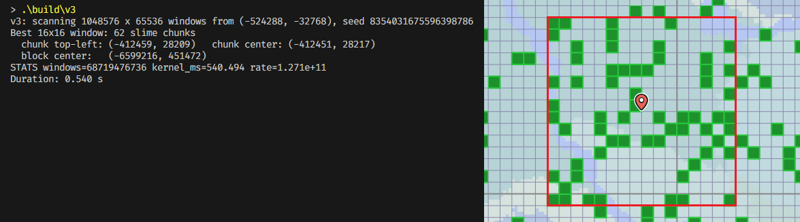
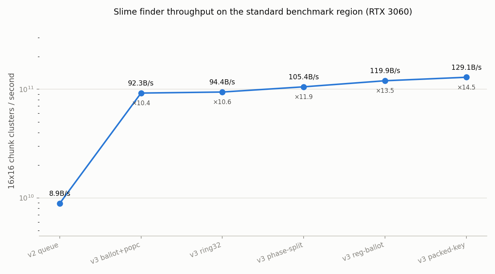

# Slime Finder
A Slime Chunk finder implementation in CUDA to find the 16x16 area with the most slime chunks around.



## Commands
```sh
# build the v2 baseline and v3
make build

# scan the default benchmark region (2^20 x 2^16 windows)
./build/v3

# scan a custom region: seed, window top-left origin, window counts
./build/v3 <seed> <x0> <z0> <x_count> <z_count>

# full world (~2 minutes on an RTX 3060)
./build/v3 <seed> -1875000 -1875000 3749985 3749985

# correctness: RNG unit tests + CPU brute-force cross-checks
make verify

# benchmark all kernel variants / record a result into the progress chart
make tune
make bench
```

## Algorithms
Throughput is measured in 16x16 window positions per second on the standard
benchmark region (`bench/results.csv`, RTX 3060 12GB):



### v1
Each device thread computes 1 full row of chunks at a given Z coord, checking
all 256 chunks of the 16x16 window at every position. The host then finds the
best row from the results.

### v2 — queue (`src/v2.cu`) — 8.9 G windows/s
Same one-thread-per-row layout, but when the window slides one step to the
right only one new 16-tall column has to be computed; a small queue remembers
the other 15 column sums. **The hidden waste**: the threads for row z and row
z+1 have windows that overlap by 15 rows, so they redo almost all of each
other's work. Every chunk on the map still gets `is_slime`-checked ~16 times,
once per overlapping row.

### v3 — ballot+popc (`src/v3.cu`) — 92.3 G windows/s (x10.4)
The big one: check every chunk exactly **once** by making threads cooperate on
a shared patch of the map (a tile) instead of each working alone.
- A chunk's result is just yes/no, so it is stored as a single **bit**. GPUs
  run threads in groups of 32 (*warps*), and the hardware `ballot` instruction
  merges the 32 threads' yes/no answers into one 32-bit integer in one go. A
  1024-chunk row of the map becomes just 32 integers, kept in the fast on-chip
  memory the tile's threads share.
- "How many slimes in these 16 side-by-side chunks?" is then "how many 1-bits
  here?" — one hardware `popcount` instruction.
- For the vertical direction each thread keeps a running total per window:
  add the newest row's 16-bit count, subtract the count of the row that just
  fell out of the window 16 rows back (remembered in a small circular buffer).
- Net effect: one slime check + two bit-counts per window position, instead of
  sixteen slime checks. The slime check itself also got cheaper: its two XOR
  constants fold into one, a redundant masking step is dropped, and the
  quadratic seed terms (which each depend on only one axis) are precomputed
  into lookup tables.

### v3 — ring32 — 94.4 G windows/s (x10.6)
The circular buffer wraps its index with "index mod size", and integer
division/modulo is one of the slowest ALU operations. Growing the buffer from
18 to 32 slots makes the size a power of two, so the wrap-around becomes a
single bitwise AND.

### v3 — phase-split — 105.4 G windows/s (x11.9)
Warp threads march in lockstep, so `if`s inside the hottest loop force the
hardware to bookkeep who took which branch — even when the answer is almost
always the same. The row loop had checks like "have we filled the first 15
rows yet?", true only 15 times out of ~4000. Splitting the loop into three
copies (warm-up rows / first full row / steady state) removes those checks
from the code the GPU actually lives in. Same medicine for the slime formula's
`% 10 == 0`: division is slow, so it becomes a multiply-and-rotate bit trick
with the identical result.

### v3 — reg-ballot — 119.9 G windows/s (x13.5)
Two leftovers. After a warp ballots its 32 bits it was writing the integer to
shared memory and immediately reading it back — but the thread still holds it
in a register (the fastest storage there is), so that copy is used directly.
And tiles at the edge of the search region need "am I out of bounds?" checks
while interior tiles (99% of them) don't, so the kernel is compiled in a
checked and an unchecked flavor and each tile picks the right one.

### v3 — packed-key — 129.1 G windows/s (x14.5)
Tracking the best window used to be `if (v > best.score) { store score, x, z }`
— a branch plus a few writes inside the hot loop. But the score (<= 256), the
row and the column-slot all fit together in one 32-bit integer with the score
in the top bits, so `best = max(best, packed)` — a single hardware max — tracks
the winner *and where it is* at once, with no branch to make the warp diverge.
The packed key is unpacked back into coordinates once per tile, in cold code.

At this point the kernel runs close to the RTX 3060's raw integer-math limit,
which is why the curve flattens. `make tune` re-picks the kernel shape for a
different GPU (256 threads x 8 chunks per thread wins on the 3060), and
`make verify` checks everything against a straight CPU transcription of the
Java RNG, including its one-in-200-million `nextInt` rejection edge case.

For seed `8354031675596398786` the best 16x16 window in the **entire world**
(scanned border to border in 124 s) holds **67 slime chunks**, top-left chunk
`(-262220, -1206735)`, block center `(-4195392, -19307632)`.

## Benchmark tracking
`bench/bench.py` runs a binary on the standard region, appends the reported
throughput to `bench/results.csv` and regenerates `bench/progress.png`:

```sh
python bench/bench.py run build/v3.exe --label "v4 my-change" --note "what changed"
```

## Sources
- Cubiome's [implementation of java random in C](https://github.com/Cubitect/cubiomes/blob/master/rng.h).
- Tadao Takaoka's paper on [Efficient Parallel Algorithms for the Maximum Subarray Problem](https://crpit.scem.westernsydney.edu.au/confpapers/CRPITV152Takaoka.pdf).
- Hacker's Delight 10-17 (remainder by multiplication and rotation).
